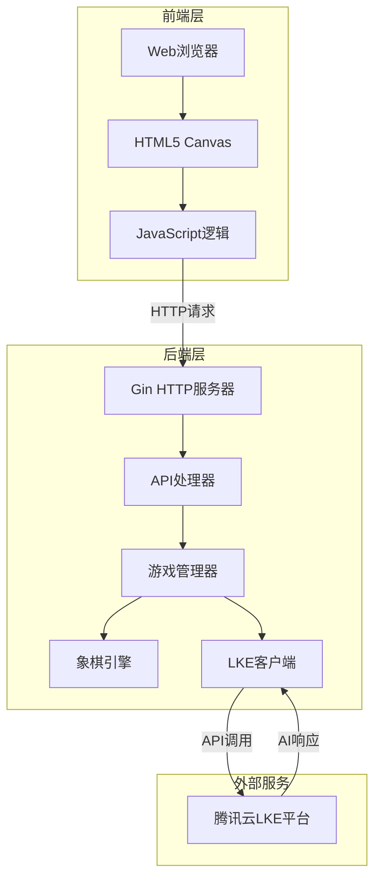

# 项目架构文档

## 系统架构图



## 技术栈

### 后端技术栈
```
Go 1.21+
├── Gin (Web框架)
├── tencentcloud-sdk-go (腾讯云SDK)
└── 标准库
    ├── net/http (HTTP服务)
    ├── encoding/json (JSON处理)
    └── sync (并发控制)
```

### 前端技术栈
```
HTML5 + CSS3 + JavaScript
├── Canvas API (棋盘绘制)
├── Fetch API (HTTP请求)
└── ES6+ (现代JavaScript)
```

## 模块设计

### 1. 主程序 (main.go)
```
main.go
├── 初始化配置
├── 创建HTTP服务器
├── 注册路由
└── 启动服务
```

**职责**：
- 程序入口
- 服务器初始化
- 路由配置
- CORS处理

### 2. 配置模块 (internal/config)
```
config/
└── config.go
    ├── Config结构体
    ├── TencentCloudConfig
    └── LoadConfig()
```

**职责**：
- 环境变量读取
- 配置管理
- 默认值设置

### 3. 象棋引擎 (internal/chess)
```
chess/
└── board.go
    ├── Board结构体
    ├── Piece结构体
    ├── 移动规则验证
    ├── 合法性检查
    └── FEN格式转换
```

**核心功能**：
- 棋盘状态管理
- 棋子移动规则
- 合法性验证
- 状态序列化

**关键方法**：
```go
NewBoard() *Board                    // 创建新棋盘
Move(from, to Position) error        // 移动棋子
IsValidMove(from, to Position) bool  // 检查合法性
GetAllLegalMoves(color Color) []string // 获取所有合法走子
ToFEN() string                       // 转换为FEN格式
```

### 4. LKE客户端 (internal/lke)
```
lke/
└── client.go
    ├── Client结构体
    ├── Chat()方法
    ├── buildPrompt()
    ├── extractMove()
    └── GetSystemPrompt()
```

**核心功能**：
- 与腾讯云LKE交互
- 构建AI提示
- 解析AI响应
- 提取走子指令

**交互流程**：
```
1. 构建提示（棋盘状态 + 历史走子）
2. 调用LKE API
3. 解析AI响应
4. 提取MOVE指令
5. 返回走子结果
```

### 5. 游戏管理 (internal/game)
```
game/
└── manager.go
    ├── Game结构体
    ├── Manager结构体
    ├── NewGame()
    ├── PlayerMove()
    ├── AIMove()
    └── GetState()
```

**核心功能**：
- 游戏实例管理
- 玩家走子处理
- AI走子协调
- 游戏状态维护

**游戏流程**：
```
1. 创建游戏 → 初始化棋盘
2. 玩家走子 → 验证 → 执行 → 切换回合
3. AI走子 → 调用LKE → 验证 → 执行
4. 检查胜负 → 更新状态
```

### 6. API处理器 (internal/api)
```
api/
└── handler.go
    ├── NewGame()      // POST /api/game/new
    ├── PlayerMove()   // POST /api/game/move
    ├── GetGameState() // GET /api/game/:id
    └── AIMove()       // POST /api/game/:id/ai-move
```

**API设计**：
| 端点 | 方法 | 功能 | 请求体 | 响应 |
|------|------|------|--------|------|
| /api/game/new | POST | 创建游戏 | {playerColor} | 游戏状态 |
| /api/game/move | POST | 玩家走子 | {gameId, from, to} | 更新后状态 |
| /api/game/:id | GET | 获取状态 | - | 当前状态 |
| /api/game/:id/ai-move | POST | AI走子 | - | AI分析+状态 |

### 7. 前端模块 (web/)
```
web/
├── index.html        // 主页面
└── static/
    ├── style.css     // 样式
    └── app.js        // 逻辑
```

**前端架构**：
```javascript
// 状态管理
gameState = {
    id, board, turn, status,
    playerColor, aiColor, moveList
}

// 核心功能
- drawBoard()        // 绘制棋盘
- handleBoardClick() // 处理点击
- playerMove()       // 玩家走子
- requestAIMove()    // 请求AI
- updateGameInfo()   // 更新界面
```

## 数据流

### 创建游戏流程
```
用户点击"开始新游戏"
    ↓
前端发送 POST /api/game/new
    ↓
后端创建Game实例
    ↓
初始化Board和LKEClient
    ↓
返回游戏状态
    ↓
前端绘制棋盘
```

### 玩家走子流程
```
用户点击棋子 → 选中
    ↓
用户点击目标位置
    ↓
前端发送 POST /api/game/move
    ↓
后端验证合法性
    ↓
执行移动 → 切换回合
    ↓
返回新状态
    ↓
前端更新棋盘
    ↓
自动触发AI走子
```

### AI走子流程
```
前端发送 POST /api/game/:id/ai-move
    ↓
后端构建LKE请求
    ↓
调用腾讯云LKE API
    ↓
LKE返回AI分析和走子
    ↓
后端解析MOVE指令
    ↓
验证并执行走子
    ↓
返回AI分析和新状态
    ↓
前端显示AI思考过程
    ↓
更新棋盘
```

## 并发控制

### 游戏管理器
```go
type Manager struct {
    games  map[string]*Game
    config *config.Config
    mu     sync.RWMutex  // 读写锁
}
```

### 游戏实例
```go
type Game struct {
    ID        string
    Board     *chess.Board
    LKEClient *lke.Client
    mu        sync.RWMutex  // 保护游戏状态
}
```

**并发策略**：
- 使用读写锁保护共享状态
- 每个游戏独立加锁
- 避免长时间持有锁

## 错误处理

### 分层错误处理
```
API层：HTTP状态码 + JSON错误信息
    ↓
业务层：返回error + 日志记录
    ↓
数据层：验证 + 错误传播
```

### 错误类型
1. **输入错误**：参数验证失败
2. **业务错误**：非法走子、不是你的回合
3. **系统错误**：LKE调用失败、网络错误
4. **状态错误**：游戏已结束

## 性能优化

### 后端优化
1. **连接复用**：LKE客户端复用
2. **并发处理**：每个游戏独立处理
3. **内存管理**：及时清理过期游戏

### 前端优化
1. **Canvas优化**：只重绘变化部分
2. **事件节流**：防止重复点击
3. **异步加载**：非阻塞UI更新

## 扩展性设计

### 水平扩展
```
负载均衡器
    ↓
多个后端实例
    ↓
共享Redis存储游戏状态
```

### 功能扩展点
1. **存储层**：添加数据库支持
2. **缓存层**：添加Redis缓存
3. **消息队列**：异步处理AI请求
4. **WebSocket**：实时对战

## 安全设计

### 输入验证
```go
// 坐标范围检查
if row < 0 || row > 9 || col < 0 || col > 8 {
    return error
}

// 回合检查
if board.Turn != playerColor {
    return error
}
```

### API安全
- CORS配置
- 请求频率限制
- 输入参数验证
- 错误信息脱敏

## 测试策略

### 单元测试
```
internal/chess/board_test.go
├── 棋盘初始化测试
├── 移动规则测试
├── 合法性检查测试
└── FEN格式测试
```

### 集成测试
```
完整游戏流程测试
├── 创建游戏
├── 玩家走子
├── AI响应
└── 游戏结束
```

## 监控指标

### 关键指标
- 游戏创建数量
- 平均对局时长
- AI响应时间
- 错误率
- 并发用户数

### 日志记录
```
[INFO] 游戏创建: game_1
[INFO] 玩家走子: 64-54
[INFO] LKE响应: MOVE: 34-44
[ERROR] AI走子失败: 非法移动
```

## 部署架构

### 单机部署
```
服务器
├── Nginx (反向代理)
├── Go应用 (后端)
└── 静态文件 (前端)
```

### 分布式部署
```
负载均衡
├── 应用服务器1
├── 应用服务器2
└── 应用服务器N
    ↓
Redis集群 (状态存储)
    ↓
腾讯云LKE (AI服务)
```

## 技术选型理由

### 为什么选择Go？
- 高性能、低延迟
- 并发支持优秀
- 部署简单（单一二进制）
- 丰富的标准库

### 为什么选择Gin？
- 轻量级、高性能
- 中间件支持
- 路由功能强大
- 社区活跃

### 为什么选择Canvas？
- 原生支持、无需依赖
- 性能优秀
- 灵活的绘图能力
- 跨平台兼容

### 为什么选择腾讯云LKE？
- 专业的AI能力
- 稳定的服务
- 灵活的配置
- 完善的文档

## 未来规划

### 短期目标
- [ ] 添加悔棋功能
- [ ] 实现对局保存
- [ ] 优化AI提示词
- [ ] 添加音效

### 中期目标
- [ ] 支持双人对战
- [ ] 添加排行榜
- [ ] 实现对局回放
- [ ] 移动端适配

### 长期目标
- [ ] 多语言支持
- [ ] 锦标赛系统
- [ ] AI训练平台
- [ ] 社区功能
